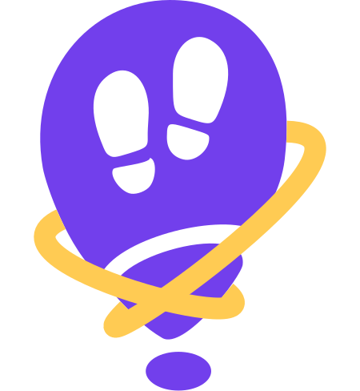

<p align="center">
  
</p>

# urwalking_sensors

Cross-platform Flutter library for high-frequency multi-sensor recording and
streaming on Android and iOS.

## Packages

The library is split so an app only downloads the plugins for the sensors it
uses. Add `urwalking_sensors` plus the add-on packages you need.

| Package | Provides | Pulls in | Needs from the app |
| --- | --- | --- | --- |
| `urwalking_sensors` | `Sensor`, `Recorder`, `CsvSink`, `MemorySink`, interpolation | nothing (pure Dart) | – |
| `urwalking_sensors_motion` | accelerometer, gyroscope, magnetometer, barometer | `sensors_plus` | – |
| `urwalking_sensors_pedometer` | step count, pedestrian status | `pedometer` | Android: `ACTIVITY_RECOGNITION` permission; iOS: `NSMotionUsageDescription` |
| `urwalking_sensors_location` | GPS position | `geolocator` | location permission; iOS: `NSLocationWhenInUseUsageDescription` |
| `urwalking_sensors_compass` | heading | `flutter_compass` | – |
| `urwalking_sensors_wifi` | Wi-Fi scan (Android only) | `wifi_scan` | location permission, location service on |
| `urwalking_sensors_bluetooth` | Bluetooth LE scan | `flutter_blue_plus` | Android 12+: `BLUETOOTH_SCAN`; iOS: `NSBluetoothAlwaysUsageDescription` |
| `urwalking_sensors_camera` | `ArPoseSensor` (ARCore / ARKit), `FrameCapture` (JPEG frames from the AR camera) | ARCore on Android (own native code) | camera permission; iOS: `NSCameraUsageDescription` |
| `urwalking_sensors_network` | `TcpStreamSink` (live), `uploadDirectory` (after recording) | `archive` (pure Dart) | Android: `INTERNET` permission (release builds) |

The library never asks for permissions itself: the app requests them (see
`example/lib/services/permission.dart`) before listening to a sensor. A
sensor without permission reports an error on its `samples` stream.

## Repository layout

| Path | What it is |
| --- | --- |
| `packages/` | The library packages above. Each exposes a single import, e.g. `package:urwalking_sensors_motion/urwalking_sensors_motion.dart`. |
| `example/` | The sensor host app, which demonstrates the library. |
| `tools/receiver/` | Python PC receiver that collects and combines recordings |

The repo is a [pub workspace](https://dart.dev/tools/pub/workspaces): one
`flutter pub get` at the root resolves all packages and the example.

## Concepts

- **`Sensor`** produces a broadcast stream of `SensorSample`s. It is only
  active while something listens to it.
- **`SensorSample`** is the one data format for all sensors: a sensor id, a
  timestamp and a map of named values.
- **`SensorClock`** is the shared, monotonic time base. All built-in sensors
  use `SensorClock.shared`, so their samples can be aligned afterwards.
- **`SampleSink`** is where samples go: CSV files, memory, a network stream...
- **`Recorder`** connects a set of sensors to a set of sinks for one recording.

```dart
import "package:urwalking_sensors/urwalking_sensors.dart";
import "package:urwalking_sensors_motion/urwalking_sensors_motion.dart";

Recorder recorder = Recorder(
  sensors: <Sensor>[AccelerometerSensor(), GyroscopeSensor()],
  sinks: <SampleSink>[CsvSink(outputDirectory)],
);
await recorder.start();
// ...
await recorder.stop();
```

For a live display, listen to a sensor directly:

```dart
AccelerometerSensor().samples.listen((SensorSample sample) {
  print(sample.values["acc_x"]);
});
```

### Adding your own sensor

Extend `StreamSensor` and map your data source to `SensorSample`s. Take
timestamps from `clock` so the samples line up with the other sensors:

```dart
class MySensor extends StreamSensor {
  @override
  String get id => "my_sensor";

  @override
  Stream<SensorSample> openSource() => myDataStream.map(
    (MyEvent event) => SensorSample(
      sensorId: id,
      timestamp: clock.now(),
      values: <String, Object?>{"my_value": event.value},
    ),
  );
}
```

### Adding your own sink

Implement `SampleSink` (`open`, `add`, `close`). `add` is called for every
sample of every sensor, so keep it fast and buffer slow work.

## Migration status

| Part | Status | Notes |
| --- | --- | --- |
| Motion, pedometer, GPS, compass, Wi-Fi, Bluetooth | ✅ in `packages/` | |
| AR pose | ✅ `ArPoseSensor` | ARCore on Android, ARKit on iOS |
| Camera frames | ✅ `FrameCapture` | shares the camera with ARCore / ARKit |
| CSV output | ✅ `CsvSink` | same format as before, read by `tools/receiver` |
| Archive upload to the PC | ✅ `uploadDirectory` | same protocol as before |
| Live stream to the PC | ✅ `TcpStreamSink` | now streams every sample, not only clock timestamps |

Known gaps:

- Timestamps are taken in Dart when a sample arrives, not by the sensor
  hardware, so they include platform channel latency (typically a few ms).
- Camera frames are timestamped natively with the wall clock, while sensors
  use `SensorClock`; both start from the same wall time but can drift apart if
  the system clock is adjusted during a recording.
- Scanning sensors only report when a scan finishes: Wi-Fi every 30 seconds
  (Android's scan limit), Bluetooth every second. Short recordings may
  contain no Wi-Fi samples at all.

### Running on iOS

iOS builds need a Mac with Xcode and a real iPhone (the simulator has no
sensors). Things that differ from Android:

- Build with `flutter run` / `flutter build`, not from the Xcode app:
  `permission_handler` enables its iOS permissions from the usage
  descriptions in `Info.plist` only when the build starts from the Flutter
  project, otherwise every permission request reports `denied`.
- Wi-Fi scanning is not available on iOS.
- Frames are only captured while the AR session runs, since ARKit owns the
  camera.
- There is no `adb reverse`: the iPhone reaches the receiver over Wi-Fi (see
  below). Recordings are stored in the app's Documents folder.

## Sending data to a PC

`urwalking_sensors_network` talks to the receiver in `tools/receiver/`; the
format is documented in [docs/protocol.md](docs/protocol.md).

```sh
python tools/receiver/receiver.py                       # over USB (sets up adb reverse)
python tools/receiver/receiver.py --host 0.0.0.0 --no-adb   # over Wi-Fi
```

Over Wi-Fi (always on iOS), tell the app where the receiver is when
building it. On a Mac, port 5000 is taken by AirPlay Receiver, so use
another upload port on both sides:

```sh
python tools/receiver/receiver.py --host 0.0.0.0 --no-adb --upload-port 5050
flutter run --dart-define=RECEIVER_HOST=<PC's IP> --dart-define=RECEIVER_UPLOAD_PORT=5050
```

Uploaded recordings land in `results/`, live streams in
`results/live/<date>/`, each with combined and interpolated CSVs. The
clock offset between phone and PC is logged to `results/timestamps.csv`.

## Testing the example app

Use a real phone: Android over USB (USB debugging on) or an iPhone (see
[Running on iOS](#running-on-ios)).

1. In the repo root, run `flutter pub get`.
2. Start the receiver in a terminal and leave it running:
   - Android: `python tools/receiver/receiver.py`
   - iPhone: `python tools/receiver/receiver.py --host 0.0.0.0 --no-adb --upload-port 5050`
3. In a second terminal, start the app (add `-d <device-id>` if several devices
   are connected, see `flutter devices`):
   - Android: `cd example`, then `flutter run`
   - iPhone: `cd example`, then `flutter run --dart-define=RECEIVER_HOST=<PC's IP> --dart-define=RECEIVER_UPLOAD_PORT=5050`
4. On the phone, accept all permissions.
5. Start and stop a recording at the bottom of the app, then check
   `results/` on the PC.

## Development

Run everything from the repo root:

```sh
flutter pub get
dart analyze packages example
(cd packages/urwalking_sensors && dart test)
(cd packages/urwalking_sensors_network && dart test)
(cd example && flutter test)
(cd example && flutter run)
```

## Resources

- [Developing packages & plugins](https://docs.flutter.dev/packages-and-plugins/developing-packages) by Flutter
- [Pub workspaces](https://dart.dev/tools/pub/workspaces) by Dart
- [Testing Flutter apps](https://docs.flutter.dev/testing/overview) by Flutter

## AI usage

Parts of this project were implemented with the help of AI tools, notably
the restructuring into library packages (`packages/`) and the network
protocol. The team defined the goals, reviewed the changes and tested them
on devices. Commits with AI involvement are marked with a
`Co-Authored-By` trailer.
